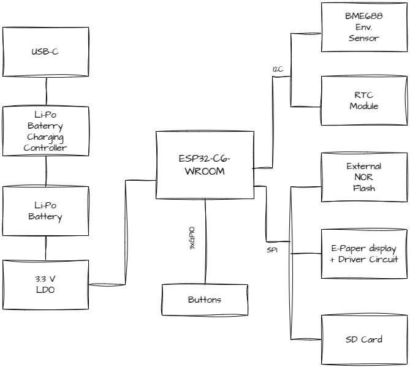

# E-Book-Reader-TSC - Bulgaru Alexandra 331CD

## Diagrama bloc

## Bill Of Materials (BOM)
| Componenta | Achizitie | Datasheet |
| ---------- | --------- | --------- |
| PFMF.050.1 | [Cumpara](https://ro.mouser.com/ProductDetail/Schurter/PFMF.050.2?qs=1auRipcfynCums5v1iucSA%3D%3D) |  [Datasheet](https://ro.mouser.com/datasheet/2/358/typ_PFMF-1275918.pdf) |
| USB4110-GF-A | [Cumpara](https://ro.mouser.com/ProductDetail/GCT/USB4110-GF-A?qs=KUoIvG%2F9IlYiZvIXQjyJeA%3D%3D) | [Datasheet](https://ro.mouser.com/datasheet/2/837/GCT_USB4110_Product_Drawing___20k_cycles-3455479.pdf) |
| USBLC6-2SC6Y | [Cumpara](https://ro.mouser.com/ProductDetail/STMicroelectronics/USBLC6-2SC6Y?qs=gNDSiZmRJS%2FOgDexvXkdow%3D%3D) | [Datasheet](https://ro.mouser.com/datasheet/2/389/usblc6_2sc6y-1852505.pdf) |
| SD0805S020S1R0 | [Cumpara](https://ro.mouser.com/ProductDetail/KYOCERA-AVX/SD0805S020S1R0?qs=jCA%252BPfw4LHbpkAoSnwrdjw%3D%3D) | [Datasheet](https://ro.mouser.com/datasheet/2/40/schottky-3165252.pdf) |
| DMG2305UX-7 | [Cumpara](https://ro.mouser.com/ProductDetail/Diodes-Incorporated/DMG2305UX-7?qs=L1DZKBg7t5F%2FNBHrjfxC%252Bg%3D%3D) | [Datasheet](https://www.diodes.com/assets/Datasheets/DMG2305UX.pdf) |
| XC6220A331MR-G | [Cumpara](https://ro.mouser.com/ProductDetail/Torex-Semiconductor/XC6220A331MR-G?qs=AsjdqWjXhJ8ZSWznL1J0gg%3D%3D) | [Datasheet](https://ro.mouser.com/datasheet/2/760/xc6220-3371556.pdf) |
| Condensator 100 uF TANT | [Cumpara](https://ro.mouser.com/ProductDetail/KYOCERA-AVX/TAJW107M010RNJ?qs=Wtp%252Bf%2FAeVqIH8v1VxV%252B1Rg%3D%3D) | [Datasheet](https://ro.mouser.com/datasheet/2/40/TAJ-3165264.pdf) |
| 112A-TAAR-R03_ATTEND | [Cumpara](https://www.digikey.ro/en/products/detail/attend-technology/112A-TAAR-R03/17633923) | [Datasheet](https://www.attend.com.tw/data/download/file/112A-TAAR-R03_Spec.pdf)
| ESP32-C6-WROOM-1-N8 | [Cumpara](https://ro.mouser.com/ProductDetail/Espressif-Systems/ESP32-C6-WROOM-1-N8?qs=8Wlm6%252BaMh8ST02Gmwp74cw%3D%3D) | [Datasheet](https://ro.mouser.com/datasheet/2/891/Espressif_ESP32_C6_WROOM_1__Datasheet_V0_1_PRELIMI-3239987.pdf) |
| MCP73831 | [Cumpara](https://ro.mouser.com/ProductDetail/Microchip-Technology/MCP73831T-2ACI-OT?qs=yUQqVecv4qvbBQBGbHx0Mw%3D%3D) | [Datasheet](https://ro.mouser.com/datasheet/2/268/MCP73831_Family_Data_Sheet_DS20001984H-3441711.pdf) |
| CHG_LED | [Cumpara](https://store.comet.srl.ro/Catalogue/Product/40478/) | [Datasheet](https://www.snapeda.com/parts/KP-1608SURCK/Kingbright/datasheet/) |
| SI1308EDL-T1-GE3 | [Cumpara](https://ro.mouser.com/ProductDetail/Vishay-Semiconductors/SI1308EDL-T1-GE3?qs=bX1%252BNvsK%2FBramh9tgpOaEw%3D%3D) | [Datasheet](https://www.vishay.com/doc?63399) |
| MBR0530 | [Cumpara](https://ro.mouser.com/ProductDetail/Micro-Commercial-Components-MCC/MBR0530-T?qs=9VyI4qLX4NTSXkb9ynzJnA%3D%3D) | [Datasheet](https://ro.mouser.com/datasheet/2/258/mcc_mbr0520~mbr0560sod123-1179695.pdf) |
| Bobina | [Cumpara](https://ro.mouser.com/ProductDetail/Wurth-Elektronik/744043680?qs=PGXP4M47uW6VkZq%252BkzjrHA%3D%3D) | [Datasheet](https://www.we-online.com/components/products/datasheet/744043680.pdf) |
| FH34SRJ-24S-0.5SH_99_ | [Cumpara](https://ro.mouser.com/ProductDetail/Hirose-Connector/FH34SRJ-24S-0.5SH99?qs=vcbW%252B4%252BSTIpKBl5ap9J8Fw%3D%3D) | [Datasheet](https://ro.mouser.com/datasheet/2/185/FH34SRJ_24S_0_5SH_99__CL0580_1255_6_99_2DDrawing_0-1615044.pdf) |
| BME688 | [Cumpara](https://ro.mouser.com/ProductDetail/Bosch-Sensortec/BME688?qs=IS%252B4QmGtzzqQoVDscqwx3A%3D%3D) | [Datasheet](https://ro.mouser.com/datasheet/2/783/bst_bme688_fl000-2307034.pdf) |
| BD5229G-TR | [Cumpara](https://ro.mouser.com/ProductDetail/ROHM-Semiconductor/BD5229G-TR?qs=4kLU8WoGk0vvnhrrYwdszw%3D%3D) | [Datasheet](https://fscdn.rohm.com/en/products/databook/datasheet/ic/power/voltage_detector/bd52xxg-e.pdf) |
| Buton adaptat | [Cumpara](https://ro.mouser.com/ProductDetail/CK/KMR221GULCLFS?qs=u2NJ%252B70r0goBXaNk7IrU0Q%3D%3D) | [Datasheet](https://www.ckswitches.com/media/1479/kmr2.pdf) |
| MAX17048G+T10 | [Cumpara](https://ro.mouser.com/ProductDetail/Analog-Devices-Maxim-Integrated/MAX17048G%2bT10?qs=D7PJwyCwLAoGnnn8jEPRBQ%3D%3D) | [Datasheet](https://ro.mouser.com/datasheet/2/609/MAX17048_MAX17049-3469099.pdf) |
| W25Q512JVEIQ | [Cumpara](https://ro.mouser.com/ProductDetail/Winbond/W25Q512JVEIQ?qs=l7cgNqFNU1jw6svr3at6tA%3D%3D) | [Datasheet](https://ro.mouser.com/datasheet/2/949/Winbond_W25Q512JV_Datasheet-3240039.pdf) |
| PGB1010603MR | [Cumpara](https://ro.mouser.com/ProductDetail/Littelfuse/PGB1010603MRHF?qs=KvZd0dN2Zg%2FuIq6icj%252BGKA%3D%3D) | [Datasheet](https://www.littelfuse.com/media?resourcetype=datasheets&itemid=8a337998-d54d-466b-be4e-dc5bcd1f9321&filename=littelfuse_pulseguard_pgb1_datasheet.pdf) |
| QWIIC_RIGHT_ANGLE | [Cumpara](https://ro.mouser.com/ProductDetail/GCT/USB4110-GF-A?qs=KUoIvG%2F9IlYiZvIXQjyJeA%3D%3D) | [Datasheet](https://ro.mouser.com/datasheet/2/837/GCT_USB4110_Product_Drawing___20k_cycles-3455479.pdf) |
| DS3231SN# | [Cumpara](https://ro.mouser.com/ProductDetail/Analog-Devices-Maxim-Integrated/DS3231SN?qs=ffX8NcjNb2RmKAb9wAk9Ug%3D%3D) | [Datasheet](https://ro.mouser.com/datasheet/2/609/DS3231-3421123.pdf) |
| CPH3225A C10_SUPERCAP | [Cumpara](https://ro.mouser.com/ProductDetail/Seiko-Semiconductors/CPH3225A?qs=3etwrb1wR%252BhUOph6lAO7eg%3D%3D) | [Datasheet](https://ro.mouser.com/datasheet/2/360/Seiko_Instruments_MicroBattery_E_20230330_2024Jan_-3561061.pdf) |
| Condensator 100nF | [Cumpara](https://ro.mouser.com/ProductDetail/KYOCERA-AVX/06033G104ZAT2A?qs=NXubJDmysXJMPmHfVo6Z%252BA%3D%3D) | [Datasheet](https://ro.mouser.com/datasheet/2/40/KGM_Y5V-3223189.pdf) |
| Condensator 4.7uF | [Cumpara](https://ro.mouser.com/ProductDetail/KYOCERA-AVX/0402ZD475MAT2A?qs=NBFAU1oqP4W4U2PCPHI0sg%3D%3D) | [Datasheet](https://ro.mouser.com/datasheet/2/40/cx5r_KGM-3223198.pdf) |
| Condensator 10uF | [Cumpara](https://ro.mouser.com/ProductDetail/Samsung-Electro-Mechanics/CL10A106KQ8NNNL?qs=xZ%2FP%252Ba9zWqaes9JKSsob2Q%3D%3D) | [Datasheet](https://ro.mouser.com/datasheet/2/585/MLCC-1837944.pdf) |
| Condensator 1uF/50V | [Cumpara](https://ro.mouser.com/ProductDetail/KYOCERA-AVX/06035D105MAT2A?qs=k4kUdCzLgS5%252BURKe1SOIeQ%3D%3D) | [Datasheet](https://ro.mouser.com/datasheet/2/40/cx5r_KGM-3223198.pdf) |
| Rezistenta 10K | [Cumpara](https://ro.mouser.com/ProductDetail/Vishay-Beyschlag/MCS0402MD1002BE000?qs=17u8i%2FzlE8%2F9BrAaXkMk1w%3D%3D) | [Datasheet](https://www.vishay.com/doc?28952) |
| Rezistenta 200 | [Cumpara](https://ro.mouser.com/ProductDetail/Vishay-Beyschlag/MCS0402MD2000BE100?qs=3SvaY9RawMJNVte4F12%252BZQ%3D%3D) | [Datasheet](https://www.vishay.com/doc?28952) |
| Rezistenta 100K | [Cumpara](https://ro.mouser.com/ProductDetail/Vishay-Beyschlag/MCT0603PD1003DP500?qs=5aG0NVq1C4wWAn8Ei3OpZA%3D%3D) | [Datasheet](https://www.vishay.com/doc?28916) |
| Rezistenta 2.2 | [Cumpara](https://ro.mouser.com/ProductDetail/SEI-Stackpole/RMCF0402FT2R20?qs=IPgv5n7u5QbBgyl0jwhwsA%3D%3D) | [Datasheet](https://ro.mouser.com/datasheet/2/385/SEI_RMCF_RMCP-3077565.pdf) |
| Rezistenta 5K1| [Cumpara](https://www.venkel.com/part/TFCR0603-16W-K-5690FT) | [Datasheet](https://data.venkel.com/documents/tfcr-series?_gl=1*tdo8m*_ga*NTA1MTc5MTcyLjE3NDM4OTMzNjc.*_ga_JRKGBZNVM8*MTc0Mzg5MzM2Ni4xLjAuMTc0Mzg5MzM2OC41OC4wLjA.) |
| Rezistenta 2K | [Cumpara](https://ro.mouser.com/ProductDetail/Vishay-Beyschlag/MCS04020C2001FE000?qs=wTZ%2FFzl837YG0wIkZJJOwQ%3D%3D) | [Datasheet](https://www.vishay.com/doc?28705) |
| Rezistenta 0.47 | [Cumpara](https://ro.mouser.com/ProductDetail/SEI-Stackpole/CSR0402JKR470?qs=IPgv5n7u5QawIB6nBEt8wA%3D%3D) | [Datasheet](https://ro.mouser.com/datasheet/2/385/SEI_CSR_CSRN-3077593.pdf) |
| Rezistenta 15 | [Cumpara](https://ro.mouser.com/ProductDetail/YAGEO/RT0402FRE0715RL?qs=BXCcY9r%252B08DFFpLSkPOIqQ%3D%3D) | [Datasheet](https://ro.mouser.com/datasheet/2/447/PYu_RT_1_to_0_01_RoHS_L_15-3461507.pdf) |

## Functionalitatea Hardware
#### Alimentare & Baterie:
USB-C furnizeaza 5 V, intra in controllerul de incarcare Li-Po si LDO-ul de 3.3 V. Acest 3.3 V alimenteaza microcontrolerul (ESP32-C6), senzorii si perifericele. Bateria Li-Po asigura functionarea cand nu este disponibila o sursa USB.

Microcontrolerul (ESP32-C6) ruleaza firmware-ul, se conecteaza la retea (Wi-Fi 6, BLE), citeste senzorii interni (BME688, DS3231) si scrie/afiseaza pe ecranul E-Paper. Poate salva date sau citi fisiere din memoria externa Flash NOR sau de pe cardul SD.

#### Senzori & RTC:
BME688 (temperatura, umiditate, presiune, compusi volatili) si DS3231 (timp real) sunt pe magistrala I2C, astfel incat datele sunt preluate usor si prelucrate.

#### Afisaj E-Paper:
Se actualizeaza prin magistrala SPI; microcontrolerul trimite datele necesare prin pinul EPD_CS (chip select), EPD_DC (command/data), EPD_RST, iar afisajul confirma starea prin EPD_BUSY.

#### Extensii:
Qwiic / Stemma QT ofera posibilitatea de a conecta senzori suplimentari pe magistrala I2C; exista si un slot SD.

## Pini ESP32-C6
| Nume      | GPIO / Pin       | Functie                                         | Descriere                                                                                                                    |
|-----------------|------------------|-------------------------------------------------|------------------------------------------------------------------------------------------------------------------------------|
| **3V3**         | 3V3             | Sursa principala de 3.3V                        | Asigura alimentarea necesara functionarii ESP32-C6 si a componentelor logice de pe placa                                     |
| **EN (Reset)**  | EN              | Activare/Dezactivare microcontroler             | Controleaza alimentarea interna a modulului ESP32-C6; un impuls LOW poate reseta intregul sistem                             |
| **USB_D-**      | IO12            | Linia negativa pentru USB                       | Utilizata in transferul de date prin protocol USB 2.0, in pereche diferentiala cu USB_D+                                     |
| **USB_D+**      | IO13            | Linia pozitiva pentru USB                       | Utilizata in transferul de date prin protocol USB 2.0, in pereche diferentiala cu USB_D-                                     |
| **Buton Boot**  | IO9             | Intrare in modul bootloader                     | Se conecteaza la masa pentru a forta incarcarea bootloader-ului ESP32-C6 (flash/programare firmware)                         |
| **Buton Change**| IO15            | Comutare mod de operare                         | Poate fi configurat in firmware pentru a schimba starea aplicatiei sau diverse moduri de functionare                        |
| **TX (UART)**   | TXD0 / GPIO16   | Emisie seriala (UART)                           | Trimite date catre un terminal serial sau adaptor USB-serial, folosit pentru debug sau comunicatie                          |
| **RX (UART)**   | RXD0 / GPIO17   | Receptie seriala (UART)                         | Primeste date de la un terminal serial sau adaptor USB-serial, folosit pentru debug sau comunicatie                         |
| **SCK (SPI)**   | IO6             | Ceas SPI pentru transfer de date                | Genereaza impulsurile de sincronizare pentru toate dispozitivele conectate la magistrala SPI                                 |
| **MOSI (SPI)**  | IO7             | Linie de date catre dispozitive SPI (Master Out)| Transmite informatii de la microcontroler catre NOR Flash, card SD si ecran E-Paper                                          |
| **MISO (SPI)**  | IO2             | Linie de date de la dispozitive SPI (Master In) | Receptioneaza informatii de la card SD, E-Paper si alte periferice SPI                                                      |
| **FLASH_CS**    | IO11            | Selectare chip pentru memoria NOR Flash         | Activeaza NOR Flash atunci cand se lucreaza cu acesta pe magistrala SPI                                                      |
| **EPD_CS**      | IO10            | Selectare chip pentru E-Paper                   | Activeaza modulul E-Paper pe magistrala SPI in timpul transferului de date                                                  |
| **EPD_DC**      | IO5             | Diferentiere comanda/date pentru E-Paper        | Indica daca informatia transmisa pe SPI reprezinta instructiuni de control sau date de afisare                              |
| **EPD_RST**     | IO23            | Reset extern E-Paper                            | Permite repornirea hardware a modulului E-Paper in cazul in care este necesar                                               |
| **EPD_BUSY**    | IO3             | Semnal de ocupare E-Paper                       | Avertizeaza microcontrolerul ca E-Paper este in curs de actualizare si nu poate primi alte comenzi                          |
| **SDA (I2C)**   | IO21            | Linie de date I2C                               | Utilizata pentru comunicatia bidirectionala cu RTC DS3231, senzor BME688 si conector Qwiic/Stemma QT                        |
| **SCL (I2C)**   | IO22            | Linie de ceas I2C                               | Sincronizeaza toate transferurile de pe magistrala I2C, inclusiv cu RTC, senzori si module de extensie                     |
| **SS_SD**       | IO4             | Chip Select pentru card SD (SPI)               | Stabileste cand cardul SD este activ pe magistrala SPI, prevenind conflicte cu alte dispozitive                            |
| **I2C_PW**      | IO19            | Control alimentare senzori I2C                 | Poate porni sau opri tensiunea pentru senzorii conectati la magistrala I2C, contribuind la economisirea energiei           |
| **EPD_3V3_C**   | IO20            | Alimentare 3.3V dedicata E-Paper               | Linie separata de 3.3V pentru a alimenta in mod specific modulul E-Paper si pentru a asigura stabilitatea semnalelor       |
| **32KHZ**       | IO1             | Linie semnal 32 kHz                            | Frecventa de ceas folosita de modulul RTC sau alte circuite care necesita un clock de 32 kHz                                |
| **INT_RTC**     | IO0             | Intrerupere de la RTC DS3231                   | Poate trezi ESP32-C6 din mod sleep sau poate semnala evenimente programate in RTC                                           |
| **RTC_RST**     | IO18            | Reset extern RTC                                | Linie pentru resetarea manuala a ceasului de timp real in situatii speciale                                                |

## Estimare consum

| Componenta       | Consum Activ (aprox) | Consum Sleep (aprox) | Observatii                                                                              |
|------------------|-----------------------|-----------------------|-----------------------------------------------------------------------------------------|
| ESP32-C6         | ~80–100 mA (Wi-Fi)   | ~10–20 µA (DeepSleep)| Principalul consumator; Wi-Fi creste semnificativ consumul in mod activ                 |
| Senzor BME688    | ~2 mA in masurare    | <1 µA in standby     | Majoritatea timpului poate fi oprit sau in standby                                     |
| RTC DS3231       | ~150–200 µA          | ~3 µA in mod backup  | Funcioneaza permanent, dar consuma relativ putin                                        |
| NOR Flash (SPI)  | ~10–30 mA            | ~1 µA (Deep PwrDown) | Activ doar la operatiile de citire/scriere                                             |
| E-Paper Display  | ~20–50 mA la refresh | ~0 µA in pasiv       | Odata afisat, nu mai consuma energie pentru mentinerea imaginii                        |
| LDO + pasive     | ~10–50 µA            | n/a                  | Curent de repaus al regulatorului si mici consumuri auxiliare (rezistente, LED-uri etc.) |

## Etape implementare
1. Schematic: Am creat schematicul pe baza schemei electrice furnizate. Am folosit biblioteca DeskAssitant si am rulat ERC pentru a verifica prezenta erorilor.

2. PCB:
- Din schematic am dat "switch to PCB" si am plasat componentele conform modelului. Am desenat placa potrivit dimensiunilor, adaugand si decuparile. Componentele principale erau destul de vizibile, condensatoarele si rezistenele le-am asezat in functie de proximitatea acestora din schematic fata de componentele mari.
-Am facut autorutare pe top si pe bottom cu 0.15 mm, apoi am modificat grosimile firelor de alimentare sa fie minim 0.30 mm.
- Am creat planurile de masa cu semnalul GND, ulterior adaugand si via stitching tot cu semnalul GND. Majoritatea via stitching-urilor le-am pozitionat in jurul antenei.

3. 3D: Am adaugat in schematic componentele 3D din [Component Search Engine](https://componentsearchengine.com). Le-am pozitionat apoi conform footprint-ului.

4. Update carcasa: Dupa ce am pozitionat placuta in carcasa, am modificat carcasa astfel incat sa se potriveasca mufele.

5. Am creat modelele 3D pentru carcasa si display conform schemelor si le-am asezat in carcasa.

## Erori/probleme intampinate
1. Am acceptat erorile de PCB de tipul SMD-Hole Board.

2. Am uitat sa verific schematicul cu ERC prima data si am rulat abia dupa ce am terminat de importat toate componentele 3D. Am observat o eroare, a trebuit sa refac o conexiune si am reluat procesul de rutare, planuri de masa si via stitching.

3. Am modificat butoanele sa se potriveasca pe footprint.

4. Cand am generat prima data placuta 3D, aveam o portiune din PCB incompleta pe care nu am vazut-o. Din acest motiv, placuta avea gauri. Am corectat si am facut iar planul de masa si via stitching.